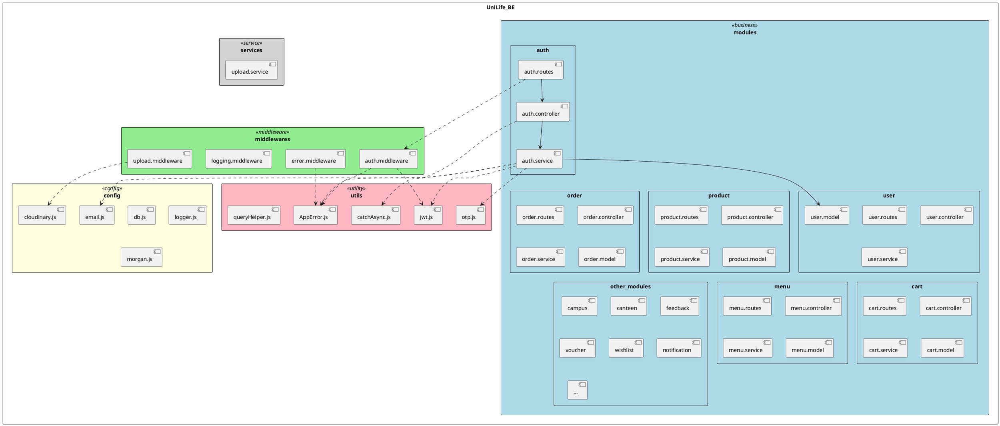

# Code Packages - UniLife Backend

## 1. Tổng Quan Kiến Trúc Package

```
┌─────────────────────────────────────────────────────────────────────────────┐
│                              UniLife_BE                                     │
│                                                                             │
│  ┌─────────────────────────────────────────────────────────────────────┐   │
│  │                         src/                                        │   │
│  │  ┌──────────────────────────────────────────────────────────────┐  │   │
│  │  │                    modules/ (Business Layer)                  │  │   │
│  │  │  ┌─────────┐ ┌─────────┐ ┌─────────┐ ┌─────────┐ ┌─────────┐ │  │   │
│  │  │  │  auth   │ │  user   │ │ product │ │  order  │ │  cart   │ │  │   │
│  │  │  └─────────┘ └─────────┘ └─────────┘ └─────────┘ └─────────┘ │  │   │
│  │  │  ┌─────────┐ ┌─────────┐ ┌─────────┐ ┌─────────┐ ┌─────────┐ │  │   │
│  │  │  │  menu   │ │ campus  │ │ canteen │ │ profile │ │ voucher │ │  │   │
│  │  │  └─────────┘ └─────────┘ └─────────┘ └─────────┘ └─────────┘ │  │   │
│  │  │  ┌─────────┐ ┌─────────┐ ┌─────────┐ ┌─────────┐ ┌─────────┐ │  │   │
│  │  │  │feedback │ │ report  │ │ notify  │ │ wishlist│ │  ...    │ │  │   │
│  │  │  └─────────┘ └─────────┘ └─────────┘ └─────────┘ └─────────┘ │  │   │
│  │  └──────────────────────────────────────────────────────────────┘  │   │
│  │                              │                                      │   │
│  │                              ▼                                      │   │
│  │  ┌─────────────────────────────────────────────────────────────┐   │   │
│  │  │                middlewares/ (Middleware Layer)               │   │   │
│  │  │  ┌────────────┐ ┌────────────┐ ┌────────────┐ ┌───────────┐ │   │   │
│  │  │  │    auth    │ │   error    │ │  logging   │ │   upload  │ │   │   │
│  │  │  └────────────┘ └────────────┘ └────────────┘ └───────────┘ │   │   │
│  │  └─────────────────────────────────────────────────────────────┘   │   │
│  │                              │                                      │   │
│  │           ┌──────────────────┴──────────────────┐                  │   │
│  │           ▼                                      ▼                  │   │
│  │  ┌─────────────────────┐              ┌─────────────────────┐      │   │
│  │  │  config/ (Config)   │              │  utils/ (Utilities) │      │   │
│  │  │  ┌─────┐ ┌───────┐  │              │  ┌─────┐ ┌───────┐  │      │   │
│  │  │  │ db  │ │ email │  │              │  │ jwt │ │  otp  │  │      │   │
│  │  │  └─────┘ └───────┘  │              │  └─────┘ └───────┘  │      │   │
│  │  │  ┌─────┐ ┌───────┐  │              │  ┌─────┐ ┌───────┐  │      │   │
│  │  │  │cloud│ │logger │  │              │  │error│ │ query │  │      │   │
│  │  │  └─────┘ └───────┘  │              │  └─────┘ └───────┘  │      │   │
│  │  └─────────────────────┘              └─────────────────────┘      │   │
│  │                                                                     │   │
│  │  ┌─────────────────────┐                                           │   │
│  │  │ services/ (Shared)  │                                           │   │
│  │  │  ┌───────────────┐  │                                           │   │
│  │  │  │upload.service │  │                                           │   │
│  │  │  └───────────────┘  │                                           │   │
│  │  └─────────────────────┘                                           │   │
│  └─────────────────────────────────────────────────────────────────────┘   │
└─────────────────────────────────────────────────────────────────────────────┘
```

---

## 2. Biểu Đồ Package Chi Tiết (PlantUML)



---

## 3. Bảng Mô Tả Package (Package Descriptions)

| No  | Package                  | Description                                                                                                                                                                              |
| --- | ------------------------ | ---------------------------------------------------------------------------------------------------------------------------------------------------------------------------------------- |
| 01  | **modules**              | Package chính chứa các business modules của hệ thống, mỗi module xử lý một domain cụ thể (auth, user, product, order,...). Mỗi module có cấu trúc: routes → controller → service → model |
| 02  | **modules/auth**         | Module xác thực người dùng: đăng ký, đăng nhập, quên mật khẩu, đổi mật khẩu, xác thực OTP, đăng nhập Google OAuth                                                                        |
| 03  | **modules/user**         | Module quản lý người dùng: CRUD thông tin user, quản lý vai trò, trạng thái tài khoản                                                                                                    |
| 04  | **modules/product**      | Module quản lý sản phẩm: CRUD sản phẩm, quản lý giá, hình ảnh, trạng thái sản phẩm                                                                                                       |
| 05  | **modules/order**        | Module quản lý đơn hàng: tạo đơn, cập nhật trạng thái, lịch sử đơn hàng, thanh toán                                                                                                      |
| 06  | **modules/cart**         | Module giỏ hàng: thêm/xóa/cập nhật sản phẩm trong giỏ, tính tổng tiền                                                                                                                    |
| 07  | **modules/menu**         | Module quản lý thực đơn: tạo menu theo ngày/ca, gán sản phẩm vào menu                                                                                                                    |
| 08  | **modules/campus**       | Module quản lý campus/cơ sở: thông tin các địa điểm trong hệ thống                                                                                                                       |
| 09  | **modules/canteen**      | Module quản lý canteen: thông tin căng tin, nhân viên, thời gian hoạt động                                                                                                               |
| 10  | **modules/voucher**      | Module quản lý voucher/khuyến mãi: tạo mã giảm giá, điều kiện áp dụng                                                                                                                    |
| 11  | **modules/wishlist**     | Module danh sách yêu thích: lưu sản phẩm yêu thích của người dùng                                                                                                                        |
| 12  | **modules/feedback**     | Module phản hồi: đánh giá sản phẩm, phản hồi dịch vụ                                                                                                                                     |
| 13  | **modules/notification** | Module thông báo: gửi thông báo đến người dùng                                                                                                                                           |
| 14  | **modules/report**       | Module báo cáo: thống kê doanh thu, đơn hàng, sản phẩm                                                                                                                                   |
| 15  | **middlewares**          | Package chứa các middleware xử lý request trước khi đến controller                                                                                                                       |
| 16  | **middlewares/auth**     | Middleware xác thực JWT token và phân quyền truy cập                                                                                                                                     |
| 17  | **middlewares/error**    | Middleware xử lý lỗi tập trung, format error response                                                                                                                                    |
| 18  | **middlewares/logging**  | Middleware ghi log request/response                                                                                                                                                      |
| 19  | **middlewares/upload**   | Middleware xử lý upload file sử dụng Multer                                                                                                                                              |
| 20  | **config**               | Package cấu hình kết nối và thiết lập hệ thống                                                                                                                                           |
| 21  | **config/db**            | Cấu hình kết nối MongoDB database                                                                                                                                                        |
| 22  | **config/email**         | Cấu hình Nodemailer để gửi email (OTP, thông báo)                                                                                                                                        |
| 23  | **config/cloudinary**    | Cấu hình Cloudinary để upload và quản lý hình ảnh                                                                                                                                        |
| 24  | **config/logger**        | Cấu hình Winston logger cho logging hệ thống                                                                                                                                             |
| 25  | **utils**                | Package chứa các utility functions dùng chung                                                                                                                                            |
| 26  | **utils/jwt**            | Utility tạo và xác thực JWT token                                                                                                                                                        |
| 27  | **utils/otp**            | Utility quản lý OTP: tạo, lưu trữ, xác thực, cooldown                                                                                                                                    |
| 28  | **utils/AppError**       | Custom Error class cho việc xử lý lỗi                                                                                                                                                    |
| 29  | **utils/catchAsync**     | Wrapper function xử lý try-catch cho async functions                                                                                                                                     |
| 30  | **utils/queryHelper**    | Utility hỗ trợ xây dựng query với filter, sort, pagination                                                                                                                               |
| 31  | **services**             | Package chứa các shared services dùng chung giữa các modules                                                                                                                             |
| 32  | **services/upload**      | Service xử lý upload file lên Cloudinary                                                                                                                                                 |

---

## 4. Cấu Trúc Module (Module Structure Pattern)

Mỗi module trong `modules/` tuân theo cấu trúc sau:

```
module_name/
├── module.routes.js      # Định nghĩa API endpoints
├── module.controller.js  # Xử lý HTTP request/response
├── module.service.js     # Business logic
└── module.model.js       # Mongoose schema (nếu có)
```

### Luồng Xử Lý Request:

```
Request → Routes → Controller → Service → Model → Database
                       ↓
                  Response ←
```

---

## 5. Quan Hệ Giữa Các Package

| STT | From Package | To Package   | Relationship | Mô tả                                             |
| --- | ------------ | ------------ | ------------ | ------------------------------------------------- |
| 1   | modules/\*   | middlewares  | Dependency   | Các routes sử dụng middleware để bảo vệ endpoints |
| 2   | modules/\*   | utils        | Dependency   | Controllers/Services sử dụng utility functions    |
| 3   | modules/\*   | config       | Dependency   | Services sử dụng config để gửi email, upload file |
| 4   | middlewares  | utils        | Dependency   | Middlewares sử dụng jwt, AppError                 |
| 5   | middlewares  | config       | Dependency   | Upload middleware sử dụng cloudinary config       |
| 6   | services     | config       | Dependency   | Upload service sử dụng cloudinary config          |
| 7   | modules/auth | modules/user | Association  | Auth service tương tác với User model             |

---

## 6. Quy Ước Đặt Tên (Naming Conventions)

| Thành phần      | Quy ước                  | Ví dụ                     |
| --------------- | ------------------------ | ------------------------- |
| Package/Folder  | camelCase hoặc lowercase | `auth`, `productCategory` |
| Routes file     | `{module}.routes.js`     | `auth.routes.js`          |
| Controller file | `{module}.controller.js` | `auth.controller.js`      |
| Service file    | `{module}.service.js`    | `auth.service.js`         |
| Model file      | `{module}.model.js`      | `user.model.js`           |
| Middleware file | `{name}.middleware.js`   | `auth.middleware.js`      |
| Config file     | `{name}.js`              | `db.js`, `email.js`       |
| Utility file    | `{name}.js`              | `jwt.js`, `otp.js`        |

---

## 7. Biểu Đồ Phụ Thuộc Đơn Giản

```
                    ┌──────────────┐
                    │   app.js     │
                    └──────┬───────┘
                           │
              ┌────────────┼────────────┐
              ▼            ▼            ▼
        ┌──────────┐ ┌──────────┐ ┌──────────┐
        │ config/  │ │middlewares│ │ modules/ │
        └────┬─────┘ └────┬─────┘ └────┬─────┘
             │            │            │
             └────────────┼────────────┘
                          ▼
                    ┌──────────┐
                    │  utils/  │
                    └──────────┘
```

**Ghi chú:**

- `app.js`: Entry point, khởi tạo Express app
- `config/`: Được sử dụng bởi tất cả các layer
- `middlewares/`: Chặn và xử lý request trước khi đến modules
- `modules/`: Chứa business logic chính
- `utils/`: Cung cấp functions dùng chung cho toàn hệ thống
